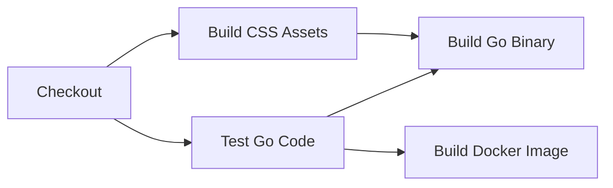

# GitHub Actions Workflows

This directory contains automated CI/CD workflows for the portfolio website.

## Overview

| Workflow | Trigger | Purpose | Outputs |
|----------|---------|---------|---------|
| [ci.yml](ci.yml) | PR, Push to main | Test & validate code | Test results, build artifacts |
| [docker-publish.yml](docker-publish.yml) | Push to main, tags | Publish Docker images | GHCR images |
| [release.yml](release.yml) | Version tags | Create releases | Multi-platform binaries |
| [deploy-to-aws.yml](deploy-to-aws.yml) | Push to main | Deploy to AWS | ECR image, ECS deployment |

## Workflow Details

### 1. CI - Test & Build

**File:** `ci.yml`

**Runs on:**
- Every pull request
- Every push to main
- Manual trigger

**Jobs:**



- **test**: Runs Go tests, checks formatting
- **build-assets**: Builds Tailwind CSS
- **build-binary**: Compiles Go binary for Linux
- **build-docker**: Builds Docker image (main only)

**Artifacts:**
- `dist-css`: Compiled Tailwind CSS (1 day retention)
- `server-binary`: Go binary for linux/amd64 (7 day retention)

### 2. Publish Docker Image

**File:** `docker-publish.yml`

**Runs on:**
- Push to main branch
- Version tags (v*.*.*)
- Manual trigger

**Output Registry:** GitHub Container Registry (ghcr.io)

**Image Tags:**
- `latest` - Latest from main branch
- `main-<sha>` - Specific commit from main
- `v1.0.0`, `v1.0`, `v1` - Semantic version tags

**Platforms:**
- linux/amd64
- linux/arm64

**Example Usage:**
```bash
docker pull ghcr.io/username/portfolio-website:latest
docker pull ghcr.io/username/portfolio-website:v1.0.0
docker pull ghcr.io/username/portfolio-website:main-abc1234
```

### 3. Release

**File:** `release.yml`

**Runs on:**
- Version tags (e.g., `v1.0.0`)
- Manual trigger with version input

**Builds for:**
- Linux: amd64, arm64
- macOS: amd64 (Intel), arm64 (Apple Silicon)
- Windows: amd64

**Outputs:**
- Release binaries
- SHA256 checksums
- Automatic release notes

**Creating a Release:**
```bash
git tag -a v1.0.0 -m "Release v1.0.0"
git push origin v1.0.0
```

### 4. Deploy to AWS

**File:** `deploy-to-aws.yml`

**Runs on:**
- Push to main
- Manual trigger

**Requirements:**
Secrets needed in repository settings:
- `AWS_ACCESS_KEY_ID`
- `AWS_SECRET_ACCESS_KEY`
- `AWS_REGION`
- `ECR_REPOSITORY`
- `ECS_CLUSTER` (optional)
- `ECS_SERVICE` (optional)

**Jobs:**
1. Build and push to ECR
2. Optionally trigger ECS deployment

## Setup Instructions

### GitHub Container Registry (GHCR)

**No secrets needed!** Uses `GITHUB_TOKEN` automatically.

1. Enable write permissions:
   - Settings → Actions → General
   - Workflow permissions: "Read and write permissions"

2. Make images public (optional):
   - Packages → portfolio-website
   - Package settings → Change visibility

### AWS Deployment

1. Create IAM user with permissions:
   - ECR: Push images
   - ECS: Update services (if using auto-deploy)

2. Add secrets:
   - Settings → Secrets and variables → Actions
   - Add all required secrets listed above

3. Push to main:
   ```bash
   git push origin main
   ```

## Simplified Bootstrapping Workflow

### For Contributors

**No local build tools needed!**

1. Fork repository
2. Make changes
3. Push branch
4. GitHub Actions tests automatically
5. Create PR

### For Deployments

**Option 1: Docker (Recommended)**
```bash
docker run -p 8080:8080 ghcr.io/username/portfolio-website:latest
```

**Option 2: Binary**
```bash
wget https://github.com/username/portfolio-website/releases/download/v1.0.0/portfolio-linux-amd64
chmod +x portfolio-linux-amd64
./portfolio-linux-amd64
```

**Option 3: AWS ECS**
- Configure secrets
- Push to main
- Automatic deployment!

## Monitoring Workflows

### View Workflow Runs

1. Go to "Actions" tab in repository
2. Select workflow from left sidebar
3. View run history and logs

### Badges

Add to README.md:

```markdown


```

## Troubleshooting

### Build Failures

**Go tests failing:**
- Check test output in CI logs
- Run locally: `make test`

**CSS build failing:**
- Check Tailwind config
- Verify `web/tailwind.css` exists

**Docker build failing:**
- Check Dockerfile syntax
- Verify all paths exist

### Permission Errors

**GHCR push failing:**
- Check workflow permissions in Settings
- Ensure `GITHUB_TOKEN` has package write access

**AWS deployment failing:**
- Verify all secrets are set
- Check IAM permissions
- Review CloudWatch logs

### Cache Issues

Clear GitHub Actions cache:
- Settings → Actions → Caches
- Delete old caches

## Costs

### GitHub Actions

- **Free tier:** 2,000 minutes/month for private repos
- **Public repos:** Unlimited free minutes

### GitHub Container Registry

- **Free:** 500MB storage
- **Free:** Unlimited public image pulls
- **Paid:** Private images count against billing

### AWS

- **ECR:** Storage fees apply
- **ECS:** Compute costs for running containers
- **Data transfer:** Outbound data charges

## Advanced Usage

### Custom Workflows

Add new workflows in `.github/workflows/`:

```yaml
name: Custom Workflow
on:
  push:
    branches: [ main ]

jobs:
  custom-job:
    runs-on: ubuntu-latest
    steps:
      - uses: actions/checkout@v4
      - name: Custom Step
        run: echo "Hello World"
```

### Matrix Builds

Test multiple Go versions:

```yaml
strategy:
  matrix:
    go-version: ['1.20', '1.21', '1.22']
steps:
  - uses: actions/setup-go@v5
    with:
      go-version: ${{ matrix.go-version }}
```

### Scheduled Runs

Run tests daily:

```yaml
on:
  schedule:
    - cron: '0 0 * * *'  # Daily at midnight UTC
```

## Security

- Never commit secrets to workflows
- Use repository secrets for sensitive data
- Regularly update action versions
- Review third-party actions before use
- Enable Dependabot for action updates

## Contributing

To modify workflows:

1. Edit workflow files in `.github/workflows/`
2. Test in a fork first
3. Create PR with changes
4. Workflows will validate themselves!

## Additional Resources

- [GitHub Actions Documentation](https://docs.github.com/en/actions)
- [Docker Build Push Action](https://github.com/docker/build-push-action)
- [AWS Actions](https://github.com/aws-actions)
- [Go Setup Action](https://github.com/actions/setup-go)
