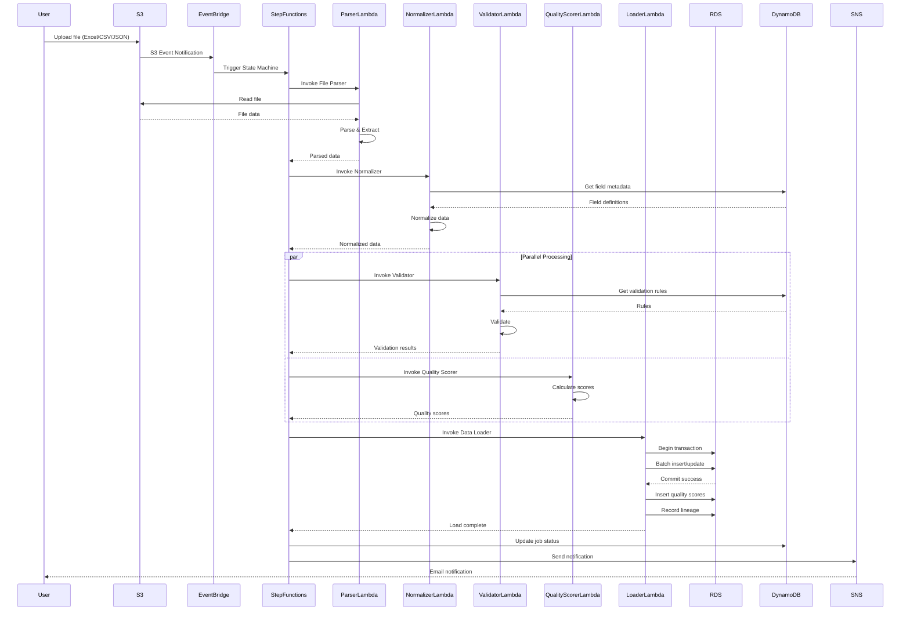

# Architectural Diagrams

This document contains detailed architectural diagrams for the Data Ingestion Pipeline system.

## Table of Contents

1. [Data Flow Sequence Diagram](#1-data-flow-sequence-diagram)
2. [AWS Service Interaction Diagram](#2-aws-service-interaction-diagram)
3. [Database Schema Diagram](#3-database-schema-diagram)
4. [Security Architecture Diagram](#4-security-architecture-diagram)
5. [Clean Architecture Layers](#5-clean-architecture-layers)
6. [Deployment Architecture](#6-deployment-architecture)

---

## 1. Data Flow Sequence Diagram



---

## 2. AWS Service Interaction Diagram

```
┌────────────────────────────────────────────────────────────────────────┐
│                            USER LAYER                                  │
└────────────────┬───────────────────────────────────────────────────────┘
                 │
                 │ HTTPS (TLS 1.3)
                 ▼
┌────────────────────────────────────────────────────────────────────────┐
│                      API GATEWAY / S3 Upload                           │
│  ┌──────────────┐         ┌──────────────┐       ┌──────────────┐    │
│  │  API Gateway │         │  S3 Landing  │       │  CloudFront  │    │
│  │   REST API   │────────▶│    Bucket    │◀──────│  (Optional)  │    │
│  └──────────────┘         └──────┬───────┘       └──────────────┘    │
└─────────────────────────────────┼────────────────────────────────────┘
                                  │
                                  │ S3 Event
                                  ▼
┌────────────────────────────────────────────────────────────────────────┐
│                       EVENT ORCHESTRATION                              │
│  ┌──────────────┐         ┌──────────────────────────────────┐       │
│  │ EventBridge  │────────▶│    Step Functions                │       │
│  │  Event Bus   │         │   (State Machine)                │       │
│  └──────────────┘         │                                  │       │
│                           │  ┌────────────────────────────┐  │       │
│                           │  │ Parse → Normalize →        │  │       │
│                           │  │ Validate → Score →         │  │       │
│                           │  │ Load → Notify              │  │       │
│                           │  └────────────────────────────┘  │       │
│                           └──────────┬───────────────────────┘       │
└──────────────────────────────────────┼────────────────────────────────┘
                                       │
                   ┌───────────────────┼───────────────────┐
                   │                   │                   │
                   ▼                   ▼                   ▼
┌────────────────────────────────────────────────────────────────────────┐
│                         COMPUTE LAYER (VPC)                            │
│                                                                        │
│  ┌─────────────────────────────────────────────────────────────────┐ │
│  │                Lambda Functions (Go 1.21)                       │ │
│  │                                                                  │ │
│  │  ┌──────────┐  ┌──────────┐  ┌──────────┐  ┌──────────┐      │ │
│  │  │  Parser  │  │Normalizer│  │Validator │  │  Scorer  │      │ │
│  │  └────┬─────┘  └────┬─────┘  └────┬─────┘  └────┬─────┘      │ │
│  │       │             │             │             │              │ │
│  │  ┌────▼────────────────────────────────────────▼─────┐        │ │
│  │  │            Data Loader Lambda                     │        │ │
│  │  └────┬──────────────────────────────────────────────┘        │ │
│  └───────┼───────────────────────────────────────────────────────┘ │
│          │                                                          │
│          │ VPC Endpoints                                            │
│          │ (Private connectivity)                                   │
│          │                                                          │
│  ┌───────▼─────────────────────────────────────────────────────┐  │
│  │                    VPC Interface Endpoints                   │  │
│  │  • S3 Gateway Endpoint                                       │  │
│  │  • DynamoDB Gateway Endpoint                                 │  │
│  │  • Secrets Manager Interface Endpoint                        │  │
│  │  • KMS Interface Endpoint                                    │  │
│  └──────────────────────────────────────────────────────────────┘  │
└────────────────────────────────────────────────────────────────────────┘
                   │                   │                   │
                   ▼                   ▼                   ▼
┌────────────────────────────────────────────────────────────────────────┐
│                         DATA LAYER                                     │
│                                                                        │
│  ┌───────────────────┐  ┌──────────────────┐  ┌──────────────────┐  │
│  │  RDS PostgreSQL   │  │    DynamoDB      │  │     S3 Buckets   │  │
│  │   Multi-AZ, HA    │  │  • Metadata      │  │  • Landing       │  │
│  │                   │  │  • Job Tracking  │  │  • Processing    │  │
│  │  • Business Data  │  │  • Cache         │  │  • Archive       │  │
│  │  • Metadata       │  │                  │  │                  │  │
│  │  • Quality Scores │  │                  │  │  Lifecycle:      │  │
│  │  • Lineage        │  │                  │  │  90d → Glacier   │  │
│  └───────────────────┘  └──────────────────┘  └──────────────────┘  │
│                                                                        │
└────────────────────────────────────────────────────────────────────────┘
                   │                   │                   │
                   ▼                   ▼                   ▼
┌────────────────────────────────────────────────────────────────────────┐
│                      SECURITY & MONITORING                             │
│                                                                        │
│  ┌──────────┐  ┌──────────┐  ┌───────────┐  ┌──────────┐           │
│  │   KMS    │  │ Secrets  │  │CloudWatch │  │CloudTrail│           │
│  │Customer  │  │ Manager  │  │Logs/Metrics│  │API Logs │           │
│  │Managed   │  │          │  │           │  │         │           │
│  │  Keys    │  │DB Creds  │  │X-Ray Trace│  │Audit    │           │
│  └──────────┘  └──────────┘  └───────────┘  └──────────┘           │
│                                                                        │
│  ┌──────────┐  ┌──────────┐  ┌───────────┐  ┌──────────┐           │
│  │GuardDuty │  │ Security │  │    WAF    │  │   SNS    │           │
│  │ Threat   │  │   Hub    │  │   Rules   │  │Alerting  │           │
│  │Detection │  │          │  │           │  │         │           │
│  └──────────┘  └──────────┘  └───────────┘  └──────────┘           │
└────────────────────────────────────────────────────────────────────────┘
```

---

## 3. Database Schema Diagram

```
┌─────────────────────────────────────────────────────────────────────┐
│                      BUSINESS DATA SCHEMA                           │
└─────────────────────────────────────────────────────────────────────┘

    ┌────────────────────────────────┐
    │      source_files              │
    ├────────────────────────────────┤
    │ PK file_id (UUID)              │
    │    file_name                   │
    │    file_path                   │
    │    file_size_bytes             │
    │    file_format                 │
    │    upload_timestamp            │
    │    processing_status           │
    │    record_count                │
    │    checksum (SHA-256)          │
    └────────────┬───────────────────┘
                 │
                 │ 1:N
                 │
    ┌────────────▼───────────────────┐
    │        entities                │
    ├────────────────────────────────┤
    │ PK entity_id (UUID)            │
    │    driving_field_value ◄────── Unique business identifier
    │    entity_type                 │
    │ FK source_file_id              │
    │    created_at                  │
    │    updated_at                  │
    │    is_active                   │
    └────────┬───────┬───────────────┘
             │       │
         1:N │       │ 1:1
             │       │
    ┌────────▼───────────────────┐   ┌────────▼───────────────────┐
    │  entity_attributes         │   │   quality_scores           │
    ├────────────────────────────┤   ├────────────────────────────┤
    │ PK attribute_id (UUID)     │   │ PK score_id (UUID)         │
    │ FK entity_id               │   │ FK entity_id               │
    │    field_name              │   │    completeness_score      │
    │    field_value             │   │    accuracy_score          │
    │    field_type              │   │    consistency_score       │
    │ FK field_metadata_id       │   │    timeliness_score        │
    │    created_at              │   │    uniqueness_score        │
    │    updated_at              │   │    validity_score          │
    └────────┬───────────────────┘   │    overall_score           │
             │                       │    calculated_at           │
             │                       └────────────────────────────┘
             │
             │ N:1
             │
    ┌────────▼───────────────────┐
    │   data_lineage             │
    ├────────────────────────────┤
    │ PK lineage_id (UUID)       │
    │ FK entity_id               │
    │ FK source_file_id          │
    │    transformation_step     │
    │    transformation_timestamp│
    │    transformation_details  │
    │    performed_by            │
    └────────────────────────────┘


┌─────────────────────────────────────────────────────────────────────┐
│                      METADATA SCHEMA                                │
└─────────────────────────────────────────────────────────────────────┘

    ┌────────────────────────────────┐
    │      field_metadata            │
    ├────────────────────────────────┤
    │ PK field_id (UUID)             │
    │    field_name (unique)         │
    │    display_name                │
    │    field_type                  │
    │    description                 │
    │    is_required                 │
    │    is_driving_field            │
    │    format_pattern (regex)      │
    │    min_value / max_value       │
    │    allowed_values (JSONB)      │
    │    business_rules (JSONB)      │
    │    quality_weight              │
    │    is_active                   │
    └────────────┬───────────────────┘
                 │
                 │ 1:N
                 │
    ┌────────────▼───────────────────┐
    │    validation_rules            │
    ├────────────────────────────────┤
    │ PK rule_id (UUID)              │
    │    rule_name                   │
    │    rule_type                   │
    │ FK field_id                    │
    │    rule_expression             │
    │    error_message               │
    │    severity                    │
    │    is_active                   │
    └────────────┬───────────────────┘
                 │
                 │ 1:N
                 │
    ┌────────────▼───────────────────┐
    │  quality_rule_results          │
    ├────────────────────────────────┤
    │ PK result_id (UUID)            │
    │ FK entity_id                   │
    │ FK rule_id                     │
    │    passed (boolean)            │
    │    actual_value                │
    │    expected_value              │
    │    error_details               │
    │    checked_at                  │
    └────────────────────────────────┘


    ┌────────────────────────────────┐
    │      quality_metrics           │
    ├────────────────────────────────┤
    │ PK metric_id (UUID)            │
    │    metric_name                 │
    │    metric_type                 │
    │    aggregation_level           │
    │    aggregation_key             │
    │    metric_value                │
    │    sample_size                 │
    │    calculation_timestamp       │
    └────────────────────────────────┘


┌─────────────────────────────────────────────────────────────────────┐
│                        INDEXES                                      │
└─────────────────────────────────────────────────────────────────────┘

• B-tree indexes on all foreign keys
• B-tree indexes on driving_field_value, entity_type
• GIN index on entity_attributes.field_value (full-text search)
• Partial indexes on is_active = true
• Composite indexes on (entity_id, field_name)
• Time-based indexes on created_at, updated_at
```

---

## 4. Security Architecture Diagram

```
┌─────────────────────────────────────────────────────────────────────┐
│                    SECURITY CONTROL LAYERS                          │
└─────────────────────────────────────────────────────────────────────┘


                         ┌──────────────┐
                         │   Internet   │
                         └──────┬───────┘
                                │
                                │ HTTPS/TLS 1.3
                                │
         ┌──────────────────────▼──────────────────────┐
         │          LAYER 1: PERIMETER                 │
         ├─────────────────────────────────────────────┤
         │  ┌──────────────┐      ┌──────────────┐    │
         │  │   AWS WAF    │      │    Shield    │    │
         │  │  • SQL Inject│      │  Standard    │    │
         │  │  • XSS Rules │      │ DDoS Protect │    │
         │  │  • Rate Limit│      └──────────────┘    │
         │  └──────────────┘                           │
         └─────────────────┬───────────────────────────┘
                           │
         ┌─────────────────▼───────────────────────────┐
         │        LAYER 2: NETWORK ISOLATION           │
         ├─────────────────────────────────────────────┤
         │           VPC (10.0.0.0/16)                 │
         │                                             │
         │  ┌────────────────────────────────────┐    │
         │  │  Public Subnet (10.0.1.0/24)       │    │
         │  │  • NAT Gateway                     │    │
         │  │  • Bastion Host (optional)         │    │
         │  └────────────────────────────────────┘    │
         │                                             │
         │  ┌────────────────────────────────────┐    │
         │  │  Private Subnet (10.0.10.0/24)     │    │
         │  │  • Lambda Functions                │    │
         │  │  • RDS PostgreSQL                  │    │
         │  │                                    │    │
         │  │  Security Group Rules:             │    │
         │  │  ├─ Lambda → RDS (5432)            │    │
         │  │  ├─ Lambda → S3 (via endpoint)     │    │
         │  │  └─ Deny all other                 │    │
         │  └────────────────────────────────────┘    │
         │                                             │
         │  ┌────────────────────────────────────┐    │
         │  │  VPC Endpoints (Private Link)      │    │
         │  │  • S3 Gateway Endpoint             │    │
         │  │  • DynamoDB Gateway Endpoint       │    │
         │  │  • Secrets Manager Interface       │    │
         │  │  • KMS Interface                   │    │
         │  └────────────────────────────────────┘    │
         └─────────────────┬───────────────────────────┘
                           │
         ┌─────────────────▼───────────────────────────┐
         │        LAYER 3: IDENTITY & ACCESS           │
         ├─────────────────────────────────────────────┤
         │                                             │
         │  IAM Policies (Least Privilege)             │
         │  ┌────────────────────────────────────┐    │
         │  │  Lambda Execution Role             │    │
         │  │  Permissions:                      │    │
         │  │  ✓ S3:GetObject (specific buckets) │    │
         │  │  ✓ KMS:Decrypt (specific keys)     │    │
         │  │  ✓ Secrets:GetValue (DB creds)     │    │
         │  │  ✗ S3:DeleteObject                 │    │
         │  │  ✗ RDS:DeleteDBInstance            │    │
         │  └────────────────────────────────────┘    │
         │                                             │
         │  Service-to-Service Authentication          │
         │  • IAM Role-based (no static credentials)   │
         │  • Temporary security tokens (STS)          │
         │  • MFA for admin access                     │
         └─────────────────┬───────────────────────────┘
                           │
         ┌─────────────────▼───────────────────────────┐
         │         LAYER 4: DATA PROTECTION            │
         ├─────────────────────────────────────────────┤
         │                                             │
         │  Encryption at Rest                         │
         │  ┌────────────────┬───────────────────┐    │
         │  │ S3             │ SSE-KMS           │    │
         │  │ RDS            │ TDE + KMS         │    │
         │  │ DynamoDB       │ AWS-managed KMS   │    │
         │  │ EBS (Lambda)   │ KMS encrypted     │    │
         │  │ Secrets Mgr    │ KMS encrypted     │    │
         │  └────────────────┴───────────────────┘    │
         │                                             │
         │  Encryption in Transit                      │
         │  • TLS 1.3 for all connections              │
         │  • Certificate validation enforced          │
         │  • No plaintext communication               │
         │                                             │
         │  Field-Level Encryption (PII)               │
         │  • SSN, Credit Cards, Passwords             │
         │  • Client-side encryption option            │
         └─────────────────┬───────────────────────────┘
                           │
         ┌─────────────────▼───────────────────────────┐
         │      LAYER 5: APPLICATION SECURITY          │
         ├─────────────────────────────────────────────┤
         │                                             │
         │  Input Validation                           │
         │  • File type validation (magic bytes)       │
         │  • File size limits (500MB max)             │
         │  • Malware scanning (ClamAV)                │
         │  • Schema validation                        │
         │                                             │
         │  Injection Prevention                       │
         │  • Parameterized SQL queries                │
         │  • Input sanitization                       │
         │  • Output encoding                          │
         │                                             │
         │  OWASP Top 10 Mitigations                   │
         │  ✓ SQL Injection                            │
         │  ✓ Broken Authentication                    │
         │  ✓ Sensitive Data Exposure                  │
         │  ✓ XXE (XML External Entities)              │
         │  ✓ Broken Access Control                    │
         └─────────────────┬───────────────────────────┘
                           │
         ┌─────────────────▼───────────────────────────┐
         │    LAYER 6: MONITORING & DETECTION          │
         ├─────────────────────────────────────────────┤
         │                                             │
         │  CloudTrail (API Auditing)                  │
         │  • All API calls logged                     │
         │  • Logs encrypted and archived              │
         │  • Integrity validation enabled             │
         │                                             │
         │  GuardDuty (Threat Detection)               │
         │  • Anomaly detection                        │
         │  • Compromised instance detection           │
         │  • Reconnaissance detection                 │
         │                                             │
         │  Security Hub (Compliance)                  │
         │  • CIS AWS Foundations                      │
         │  • PCI-DSS compliance                       │
         │  • HIPAA compliance (if needed)             │
         │                                             │
         │  CloudWatch Alarms                          │
         │  • Failed authentication attempts           │
         │  • Unusual data access patterns             │
         │  • Error rate spikes                        │
         └─────────────────┬───────────────────────────┘
                           │
         ┌─────────────────▼───────────────────────────┐
         │     LAYER 7: INCIDENT RESPONSE              │
         ├─────────────────────────────────────────────┤
         │                                             │
         │  Automated Remediation                      │
         │  • Quarantine compromised resources         │
         │  • Revoke suspicious credentials            │
         │  • Isolate affected network segments        │
         │                                             │
         │  Alerting                                   │
         │  • SNS notifications (email/SMS)            │
         │  • PagerDuty integration                    │
         │  • Slack/Teams webhooks                     │
         │                                             │
         │  Forensics & Recovery                       │
         │  • Snapshot creation                        │
         │  • Log preservation                         │
         │  • Incident timeline reconstruction         │
         └─────────────────────────────────────────────┘


┌─────────────────────────────────────────────────────────────────────┐
│                   SECURITY COMPLIANCE                               │
└─────────────────────────────────────────────────────────────────────┘

  ┌────────────┐  ┌────────────┐  ┌────────────┐  ┌────────────┐
  │   GDPR     │  │   HIPAA    │  │  SOC 2     │  │  ISO 27001 │
  │ Compliant  │  │ Compliant  │  │ Type II    │  │  Certified │
  └────────────┘  └────────────┘  └────────────┘  └────────────┘

  Key Controls:
  • Data encryption (at rest and in transit)
  • Access logging and monitoring
  • Data retention and deletion policies
  • Business Associate Agreements (BAA) with AWS
  • Regular security audits and penetration testing
```

---

## 5. Clean Architecture Layers

```
┌─────────────────────────────────────────────────────────────────────┐
│                    CLEAN ARCHITECTURE LAYERS                        │
│                  (Dependency Rule: Inward Only)                     │
└─────────────────────────────────────────────────────────────────────┘


        Outer Layer                                      Inner Layer
        (Details)                                          (Core)
            │                                                 │
            │                                                 │
            ▼                                                 ▼

┌───────────────────────────────────────────────────────────────────────┐
│                        LAYER 4: INTERFACES                            │
│                     (Frameworks & Drivers)                            │
├───────────────────────────────────────────────────────────────────────┤
│                                                                       │
│  ┌────────────────────────────────────────────────────────────────┐  │
│  │  Lambda Handlers                                               │  │
│  │  • handler/parser_handler.go                                   │  │
│  │  • handler/normalizer_handler.go                               │  │
│  │  • handler/validator_handler.go                                │  │
│  │  • handler/loader_handler.go                                   │  │
│  └────────────────────────────────────────────────────────────────┘  │
│                                                                       │
│  ┌────────────────────────────────────────────────────────────────┐  │
│  │  Event Processors                                              │  │
│  │  • events/s3_event_processor.go                                │  │
│  │  • events/step_functions_integration.go                        │  │
│  └────────────────────────────────────────────────────────────────┘  │
│                                                                       │
└───────────────────────┬───────────────────────────────────────────────┘
                        │
                        │ depends on
                        ▼
┌───────────────────────────────────────────────────────────────────────┐
│                   LAYER 3: INFRASTRUCTURE                             │
│              (Interface Adapters - Implementations)                   │
├───────────────────────────────────────────────────────────────────────┤
│                                                                       │
│  ┌────────────────────────────────────────────────────────────────┐  │
│  │  Repository Implementations                                    │  │
│  │  • repository/postgres/entity_repository.go                    │  │
│  │  • repository/postgres/metadata_repository.go                  │  │
│  │  • repository/dynamodb/cache_repository.go                     │  │
│  └────────────────────────────────────────────────────────────────┘  │
│                                                                       │
│  ┌────────────────────────────────────────────────────────────────┐  │
│  │  External Service Adapters                                     │  │
│  │  • storage/s3_storage.go                                       │  │
│  │  • secrets/aws_secrets_manager.go                              │  │
│  │  • logger/cloudwatch_logger.go                                 │  │
│  │  • notification/sns_notifier.go                                │  │
│  └────────────────────────────────────────────────────────────────┘  │
│                                                                       │
│  ┌────────────────────────────────────────────────────────────────┐  │
│  │  File Parsers                                                  │  │
│  │  • parser/excel_parser.go (implements FileParser interface)    │  │
│  │  • parser/csv_parser.go                                        │  │
│  │  • parser/json_parser.go                                       │  │
│  │  • parser/xml_parser.go                                        │  │
│  │  • parser/parquet_parser.go                                    │  │
│  └────────────────────────────────────────────────────────────────┘  │
│                                                                       │
└───────────────────────┬───────────────────────────────────────────────┘
                        │
                        │ depends on (implements interfaces from)
                        ▼
┌───────────────────────────────────────────────────────────────────────┐
│                       LAYER 2: USE CASES                              │
│                  (Application Business Rules)                         │
├───────────────────────────────────────────────────────────────────────┤
│                                                                       │
│  ┌────────────────────────────────────────────────────────────────┐  │
│  │  Use Case Interactors                                          │  │
│  │                                                                 │  │
│  │  • usecase/process_file.go                                     │  │
│  │    └─ ProcessFileUseCase                                       │  │
│  │       ├─ ValidateFile()                                        │  │
│  │       ├─ ParseFile()                                           │  │
│  │       └─ StoreMetadata()                                       │  │
│  │                                                                 │  │
│  │  • usecase/normalize_data.go                                   │  │
│  │    └─ NormalizeDataUseCase                                     │  │
│  │       ├─ IdentifyDrivingField()                                │  │
│  │       ├─ NormalizeRecords()                                    │  │
│  │       └─ MapToSchema()                                         │  │
│  │                                                                 │  │
│  │  • usecase/validate_data.go                                    │  │
│  │    └─ ValidateDataUseCase                                      │  │
│  │       ├─ ApplySchemaValidation()                               │  │
│  │       ├─ ApplyBusinessRules()                                  │  │
│  │       └─ CheckReferentialIntegrity()                           │  │
│  │                                                                 │  │
│  │  • usecase/score_quality.go                                    │  │
│  │    └─ ScoreQualityUseCase                                      │  │
│  │       ├─ CalculateCompleteness()                               │  │
│  │       ├─ CalculateAccuracy()                                   │  │
│  │       └─ CalculateOverallScore()                               │  │
│  │                                                                 │  │
│  │  • usecase/load_data.go                                        │  │
│  │    └─ LoadDataUseCase                                          │  │
│  │       ├─ BeginTransaction()                                    │  │
│  │       ├─ BatchInsertRecords()                                  │  │
│  │       ├─ RecordLineage()                                       │  │
│  │       └─ CommitTransaction()                                   │  │
│  └────────────────────────────────────────────────────────────────┘  │
│                                                                       │
│  Dependencies (Interfaces):                                           │
│  • FileParser interface                                              │
│  • DataNormalizer interface                                          │
│  • DataValidator interface                                           │
│  • QualityScorer interface                                           │
│  • Repository interfaces                                             │
│  • Storage interface                                                 │
│  • Logger interface                                                  │
│                                                                       │
└───────────────────────┬───────────────────────────────────────────────┘
                        │
                        │ depends on
                        ▼
┌───────────────────────────────────────────────────────────────────────┐
│                       LAYER 1: DOMAIN                                 │
│                 (Enterprise Business Rules)                           │
│                         CORE LAYER                                    │
├───────────────────────────────────────────────────────────────────────┤
│                                                                       │
│  ┌────────────────────────────────────────────────────────────────┐  │
│  │  Entities (Business Objects)                                   │  │
│  │                                                                 │  │
│  │  • domain/entity.go                                            │  │
│  │    └─ Entity (core business entity)                            │  │
│  │       ├─ EntityID                                              │  │
│  │       ├─ DrivingFieldValue                                     │  │
│  │       ├─ Attributes map[string]interface{}                     │  │
│  │       └─ Methods: Validate(), IsComplete()                     │  │
│  │                                                                 │  │
│  │  • domain/field_metadata.go                                    │  │
│  │    └─ FieldMetadata (field definitions)                        │  │
│  │                                                                 │  │
│  │  • domain/quality_score.go                                     │  │
│  │    └─ QualityScore (quality metrics)                           │  │
│  │                                                                 │  │
│  │  • domain/validation_rule.go                                   │  │
│  │    └─ ValidationRule (business rules)                          │  │
│  │                                                                 │  │
│  │  • domain/file_metadata.go                                     │  │
│  │    └─ FileMetadata (file information)                          │  │
│  └────────────────────────────────────────────────────────────────┘  │
│                                                                       │
│  ┌────────────────────────────────────────────────────────────────┐  │
│  │  Value Objects                                                 │  │
│  │  • domain/driving_field.go                                     │  │
│  │  • domain/quality_dimensions.go                                │  │
│  │  • domain/lineage_record.go                                    │  │
│  └────────────────────────────────────────────────────────────────┘  │
│                                                                       │
│  ┌────────────────────────────────────────────────────────────────┐  │
│  │  Repository Interfaces (NO IMPLEMENTATIONS)                    │  │
│  │  • domain/repository/entity_repository.go                      │  │
│  │  • domain/repository/metadata_repository.go                    │  │
│  │  • domain/repository/quality_repository.go                     │  │
│  └────────────────────────────────────────────────────────────────┘  │
│                                                                       │
│  ┌────────────────────────────────────────────────────────────────┐  │
│  │  Service Interfaces (NO IMPLEMENTATIONS)                       │  │
│  │  • domain/service/file_parser.go                               │  │
│  │  • domain/service/data_normalizer.go                           │  │
│  │  • domain/service/data_validator.go                            │  │
│  │  • domain/service/quality_scorer.go                            │  │
│  │  • domain/service/storage.go                                   │  │
│  │  • domain/service/logger.go                                    │  │
│  └────────────────────────────────────────────────────────────────┘  │
│                                                                       │
│  ┌────────────────────────────────────────────────────────────────┐  │
│  │  Domain Errors                                                 │  │
│  │  • domain/errors/validation_error.go                           │  │
│  │  • domain/errors/parsing_error.go                              │  │
│  │  • domain/errors/business_rule_error.go                        │  │
│  └────────────────────────────────────────────────────────────────┘  │
│                                                                       │
│  NO EXTERNAL DEPENDENCIES IN THIS LAYER                               │
│  • No AWS SDK imports                                                │
│  • No database driver imports                                        │
│  • Pure Go standard library only                                     │
│                                                                       │
└───────────────────────────────────────────────────────────────────────┘


Key Principles:
═══════════════

1. DEPENDENCY RULE
   • Outer layers depend on inner layers (never reversed)
   • Domain layer has ZERO external dependencies
   • Use Cases depend on Domain interfaces only
   • Infrastructure implements Domain interfaces

2. TESTABILITY
   • Domain logic testable without AWS/database
   • Use Cases testable with mocks
   • Infrastructure has integration tests

3. FLEXIBILITY
   • Can swap AWS for GCP without touching domain
   • Can change database without changing use cases
   • Can add new file formats by implementing interface

4. MAINTAINABILITY
   • Business logic centralized in Domain + Use Cases
   • Infrastructure changes don't affect business logic
   • Clear separation of concerns
```

---

## 6. Deployment Architecture

```
┌─────────────────────────────────────────────────────────────────────┐
│              MULTI-REGION DEPLOYMENT ARCHITECTURE                   │
└─────────────────────────────────────────────────────────────────────┘

                           ┌──────────────┐
                           │  Route 53    │
                           │  (DNS + LB)  │
                           └───────┬──────┘
                                   │
                   ┌───────────────┴───────────────┐
                   │                               │
                   ▼                               ▼
     ┌─────────────────────────┐     ┌─────────────────────────┐
     │   PRIMARY REGION        │     │    DR REGION            │
     │   us-east-1            │     │    us-west-2            │
     └─────────────────────────┘     └─────────────────────────┘


PRIMARY REGION (us-east-1)
═══════════════════════════════════════════════════════════════════════

┌────────────────────────────────────────────────────────────────────┐
│                     Availability Zone 1                            │
├────────────────────────────────────────────────────────────────────┤
│                                                                    │
│  ┌───────────────┐   ┌───────────────┐   ┌───────────────┐      │
│  │  Lambda       │   │  Lambda       │   │  Lambda       │      │
│  │  Parser       │   │  Normalizer   │   │  Validator    │      │
│  │  (3 instances)│   │  (3 instances)│   │  (2 instances)│      │
│  └───────────────┘   └───────────────┘   └───────────────┘      │
│                                                                    │
│  ┌───────────────────────────────────────────────────┐            │
│  │   RDS PostgreSQL (Primary)                        │            │
│  │   r6g.xlarge                                      │            │
│  │   • Multi-AZ enabled                              │            │
│  │   • Automated backups (7 days)                    │            │
│  │   • Performance Insights enabled                  │            │
│  │   • Enhanced monitoring (1 min granularity)       │            │
│  └───────────────────────────────────────────────────┘            │
│                                                                    │
└────────────────────────────────────────────────────────────────────┘

┌────────────────────────────────────────────────────────────────────┐
│                     Availability Zone 2                            │
├────────────────────────────────────────────────────────────────────┤
│                                                                    │
│  ┌───────────────┐   ┌───────────────┐   ┌───────────────┐      │
│  │  Lambda       │   │  Lambda       │   │  Lambda       │      │
│  │  Scorer       │   │  Loader       │   │  Metadata     │      │
│  │  (2 instances)│   │  (5 instances)│   │  (2 instances)│      │
│  └───────────────┘   └───────────────┘   └───────────────┘      │
│                                                                    │
│  ┌───────────────────────────────────────────────────┐            │
│  │   RDS PostgreSQL (Standby)                        │            │
│  │   r6g.xlarge                                      │            │
│  │   • Synchronous replication from Primary          │            │
│  │   • Automatic failover (<2 min)                   │            │
│  │   • Read replica promotion capable                │            │
│  └───────────────────────────────────────────────────┘            │
│                                                                    │
└────────────────────────────────────────────────────────────────────┘

┌────────────────────────────────────────────────────────────────────┐
│                    Regional Services                               │
├────────────────────────────────────────────────────────────────────┤
│                                                                    │
│  ┌──────────────┐  ┌──────────────┐  ┌──────────────┐           │
│  │ S3 Buckets   │  │ DynamoDB     │  │ Step Functions│          │
│  │ • Landing    │  │ • Metadata   │  │ State Machine │          │
│  │ • Processing │  │ • Job Track  │  │               │          │
│  │ • Archive    │  │ • Cache      │  │ Express WF    │          │
│  └──────────────┘  └──────────────┘  └──────────────┘           │
│                                                                    │
│  ┌──────────────┐  ┌──────────────┐  ┌──────────────┐           │
│  │ KMS Keys     │  │ Secrets Mgr  │  │ CloudWatch   │           │
│  │ Customer     │  │ DB Creds     │  │ Logs/Metrics │           │
│  │ Managed      │  │ API Keys     │  │ Alarms       │           │
│  └──────────────┘  └──────────────┘  └──────────────┘           │
│                                                                    │
└────────────────────────────────────────────────────────────────────┘


DR REGION (us-west-2)
═══════════════════════════════════════════════════════════════════════

┌────────────────────────────────────────────────────────────────────┐
│                      Standby Configuration                         │
├────────────────────────────────────────────────────────────────────┤
│                                                                    │
│  ┌───────────────────────────────────────────────────┐            │
│  │   RDS Read Replica                                │            │
│  │   r6g.large (smaller for cost optimization)       │            │
│  │   • Asynchronous replication from us-east-1       │            │
│  │   • Promotable to master                          │            │
│  │   • Cross-region automated backups                │            │
│  │                                                   │            │
│  │   Promotion Time: 5-10 minutes                    │            │
│  └───────────────────────────────────────────────────┘            │
│                                                                    │
│  ┌──────────────┐  ┌──────────────┐  ┌──────────────┐           │
│  │ S3 Replica   │  │ DynamoDB     │  │ Lambda       │           │
│  │ CRR Enabled  │  │ Global Table │  │ (Cold)       │           │
│  │              │  │ Replica      │  │ Deploy on    │           │
│  │              │  │              │  │ Failover     │           │
│  └──────────────┘  └──────────────┘  └──────────────┘           │
│                                                                    │
└────────────────────────────────────────────────────────────────────┘


DEPLOYMENT PIPELINE
═══════════════════════════════════════════════════════════════════════

┌────────────────────────────────────────────────────────────────────┐
│                         CI/CD Pipeline                             │
├────────────────────────────────────────────────────────────────────┤
│                                                                    │
│  ┌──────────┐    ┌──────────┐    ┌──────────┐    ┌──────────┐   │
│  │   Git    │───▶│  Build   │───▶│   Test   │───▶│  Deploy  │   │
│  │  Commit  │    │          │    │          │    │          │   │
│  └──────────┘    └──────────┘    └──────────┘    └──────────┘   │
│                                                                    │
│  Build Stage:                                                      │
│  • go build -tags lambda.norpc (ARM64)                             │
│  • Create deployment packages                                      │
│  • Build time: ~2 minutes                                          │
│                                                                    │
│  Test Stage:                                                       │
│  • Unit tests (coverage > 80%)                                     │
│  • Integration tests                                               │
│  • Security scanning (CodeQL, Snyk)                                │
│  • Test time: ~5 minutes                                           │
│                                                                    │
│  Deploy Stage (Blue/Green):                                        │
│  1. Deploy to Lambda (Blue version)                                │
│  2. Run smoke tests                                                │
│  3. Shift 10% traffic to Blue                                      │
│  4. Monitor for 10 minutes                                         │
│  5. Shift 100% traffic if healthy                                  │
│  6. Keep Green version for 24h (rollback)                          │
│  • Deploy time: ~15 minutes                                        │
│                                                                    │
└────────────────────────────────────────────────────────────────────┘


MONITORING & OBSERVABILITY
═══════════════════════════════════════════════════════════════════════

┌────────────────────────────────────────────────────────────────────┐
│                     Observability Stack                            │
├────────────────────────────────────────────────────────────────────┤
│                                                                    │
│  ┌────────────────────────────────────────────────────────┐       │
│  │   CloudWatch Logs Insights                             │       │
│  │   • Centralized logging                                │       │
│  │   • Log retention: 30 days                             │       │
│  │   • Structured JSON logging                            │       │
│  │   • Query performance: <1 second                       │       │
│  └────────────────────────────────────────────────────────┘       │
│                                                                    │
│  ┌────────────────────────────────────────────────────────┐       │
│  │   CloudWatch Metrics                                   │       │
│  │   • Lambda: Invocations, Duration, Errors, Throttles   │       │
│  │   • RDS: CPU, Memory, IOPS, Connections                │       │
│  │   • S3: Request metrics, Data transfer                 │       │
│  │   • Custom: Data quality scores, Processing time       │       │
│  └────────────────────────────────────────────────────────┘       │
│                                                                    │
│  ┌────────────────────────────────────────────────────────┐       │
│  │   X-Ray Distributed Tracing                            │       │
│  │   • End-to-end request tracing                         │       │
│  │   • Service map visualization                          │       │
│  │   • Latency analysis                                   │       │
│  │   • Error rate tracking                                │       │
│  └────────────────────────────────────────────────────────┘       │
│                                                                    │
│  ┌────────────────────────────────────────────────────────┐       │
│  │   CloudWatch Dashboards                                │       │
│  │   • Real-time operational metrics                      │       │
│  │   • Data quality trends                                │       │
│  │   • Cost tracking                                      │       │
│  │   • SLA monitoring                                     │       │
│  └────────────────────────────────────────────────────────┘       │
│                                                                    │
└────────────────────────────────────────────────────────────────────┘
```

---

## Summary

These diagrams provide comprehensive visual documentation for:

1. **Data Flow** - Complete sequence from file upload to data loading
2. **AWS Services** - How all AWS services interact in the solution
3. **Database Schema** - Normalized data and metadata schemas with relationships
4. **Security** - Multi-layered defense-in-depth approach
5. **Clean Architecture** - Proper separation of concerns and dependency management
6. **Deployment** - Multi-region, highly available deployment strategy

Each diagram can be rendered using Mermaid (for sequence diagrams) or standard ASCII art for documentation purposes. For production use, these would be converted to professional diagramming tools like Lucidchart, Draw.io, or AWS Architecture Icons.
